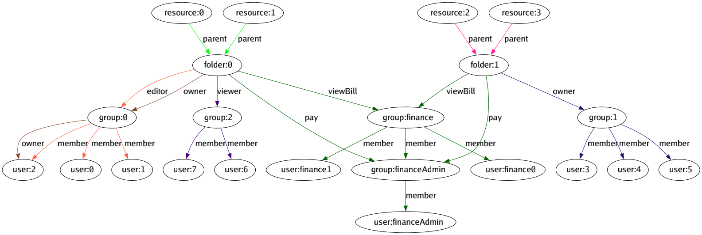

# KetoToDot
This program takes files in Ory Keto relation-tuples syntax and converts it to dot notation.
This allows to quickly see which subject has access to which object with which relation,
with a simple glance.

## Compile

To compile :
```
go build -o $GOBIN/
```

## Running the example

```
ketodot example.keto
```
This will print on stdout the DOT grammar representing the graph.
You can redirect this output into a file and then use [graphviz](https://graphviz.org/)
to render it, **or** you can simply copy and paste the output [here](https://dreampuf.github.io/GraphvizOnline/).

## How it works

The way Keto works can be understood as a simple graph reachability problem.
Objects and subjects are nodes of the graph, and the relations are the edges
between them. Asking keto to check the access for a subject on an object is
equivalent to checking if, from the object, you can reach the subject on the graph, using
only the relations given.

With this tool you can visualize this graph. You can also check that a subject has a right
on an object just by checking if the edges connecting the two are of the same color.

Currently the graph is drawn in 2 parts. The first step is to draw the nodes and
edges, the second is to color the edges.

Drawing the graph is simple, since the relation tuple gives us all the required parts
of a graph : the starting node (the object), the edge (the relation), and the destination
node (the subject). Stopping here already enables us to draw a graph representing
our data structure, but it does not provide the ability to determine at a glance if a subject
has a right on a given object.

To do that, we can use colors to represent the subgraph that is selected when
a subjectset is given. In the relation tuple `resource:1#viewer@group:1#member`,
the subjectset `group:1#member` can be expanded to a number of subjects. The coloring
of the edges represents this expansion by coloring all the edges from the object and relation
given, to all the end subjects with the same color. Here coloring is one representation
of this, that is easy to implement as a proof of concept. Ideally the same idea
could be represented by highlighting all the subjects and relations when hovering
over an edge. Basically, the coloring is the representation of the `keto expand`
command.

The given example will render the following graph.


## Current limitations

Due to how the the coloring works, the `parent#` subjectset (used for subjectset-rewrites
with parent-child inheritance, not implemented in Keto yet)
is not correctly matched with the corresponding expanded relation tuples.

Also using relation-tuples that have the same object and subject
(something like `folder:0#viewer@folder:0#editor`) will cause the
different colors for different roles to merge (as this is equivalent of doing relation
inheritance using subjectset-rewrites). The coloring representation is not powerful enough to represent
inheritance.

These problems can be solved by using the actual expand API of Keto, and using
a better representation of the expansion, using a dynamic display with highlights.